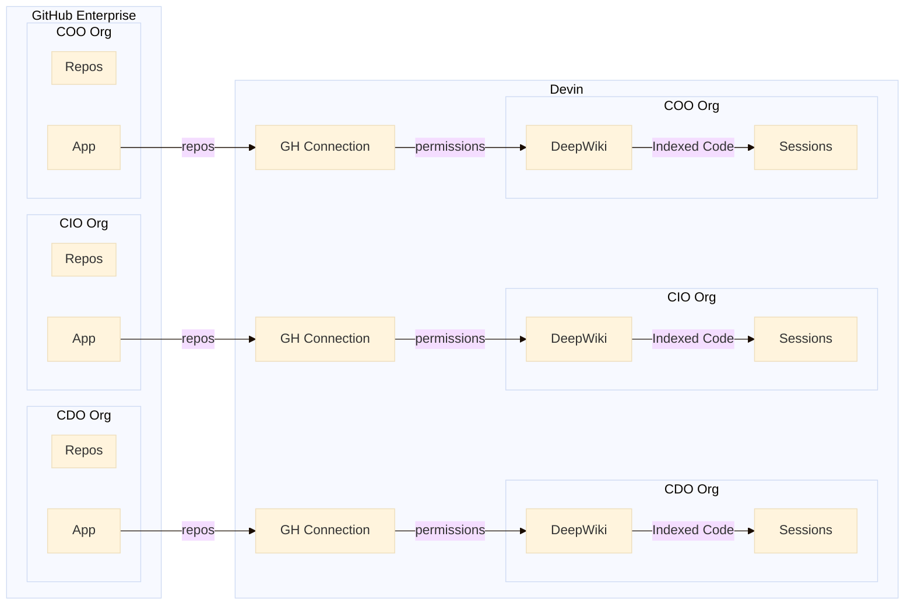

# Devin Enterprise API Example Scripts

Simple Python scripts for managing GitHub repository permissions in Devin Enterprise.

## Overview



### Step 1: Set up GitHub Connections (Manual)

Each [GitHub organization](https://docs.github.com/en/enterprise-cloud@latest/admin/managing-accounts-and-repositories/managing-organizations-in-your-enterprise/adding-organizations-to-your-enterprise#creating-a-new-organization) needs to be manually added as a [connection in Devin](https://docs.devin.ai/integrations/gh#setting-up-the-integration):

1. Go to **app.devin.ai > Enterprise Settings > Integrations > Connected Accounts > GitHub**
2. Add each GitHub organization as a separate connection
3. When creating the connection, choose to:
   - Make all repositories in the organization available to Devin, OR
   - Select specific repositories only

**Note**: The Devin integration appears as a [GitHub App](https://docs.github.com/en/enterprise-cloud@latest/apps/github-marketplace/github-marketplace-overview/about-github-marketplace-for-apps#apps). Only GitHub Enterprise account administrators or org admins typically have the permissions required to modify GitHub App installations and update Devin's repository access.

### Step 2: Provision Permissions via API (Automated)

Once GitHub connections are set up, use these scripts to programmatically manage repository permissions for your Devin [sub organizations](https://docs.devin.ai/enterprise/get-started#sub-organizations). This can also be done manually through Enterprise Settings.

### Step 3: Index Repositories (Automated)

After granting permissions, index the repositories to make them available as [Deep Wikis](https://docs.devin.ai/work-with-devin/deepwiki) for use in Devin sessions. Indexing allows Devin to understand and work with the repository codebase. This can also be done manually in the org settings page.

### Step 4: Set Up Machine Snapshots (Optional, Manual)

For repositories with specific build tools, dependencies, and environment configurations, you can set up machine snapshots through the Devin UI. This creates a pre-configured virtual machine environment that Devin uses as the starting point for each session. Configure through **Settings > Devin's Workspace** in the Devin app. See the [Repo Setup Guide](https://docs.devin.ai/onboard-devin/repo-setup) for details.

## To Automate Repo Permissions and Indexing

### Setup

1. Install dependencies:
   ```bash
   pip install -r requirements.txt
   ```

2. Set your API key in `.env`:
   ```
   DEVIN_API_KEY=your_api_key_here
   ```

### Workflow

### 1. List Your Organizations
```bash
python list_organizations.py
```
Find the organization ID you want to grant repository access to.

### 2. List Git Connections for That Organization  
```bash
python list_connections.py
```
Get the connection ID for the GitHub organization containing your repository.

### 3. Grant Repository Permissions
```bash
python repo_permissions.py
```
Add permissions for a specific repository to your Devin organization.

### 4. Index the Repository
```bash
python index_repositories.py
```
Index the repository to make it available for use in Devin sessions.

## Script Details

### `list_organizations.py`
- Lists all Devin organizations in your enterprise
- Shows organization names and IDs
- No configuration needed (uses API key from `.env`)

### `list_connections.py`
- Lists Git connections for a specific organization
- Configure the `ORG_ID` parameter with an organization ID from step 1

### `repo_permissions.py`
- Grants repository access to a Devin organization
- Configure these parameters:
  - `ORG_ID` - Organization ID from step 1
  - `CONNECTION_ID` - Git connection ID from step 2
  - `REPOSITORY_OWNER` - GitHub organization or username
  - `REPOSITORY_NAME` - Repository name

### `index_repositories.py`
- Indexes repositories to make them available in Devin sessions
- Configure these parameters:
  - `ORG_ID` - Organization ID from step 1
  - `REPOSITORIES` - List of repositories to index (format: "owner/repo")

## Example

After setting up a GitHub connection for `mycompany` organization in Devin:

1. **Find your Devin organization ID:**
   ```bash
   python list_organizations.py
   # Output: org-406782bf7ec34819b0c3bd0ba67a5c84 (org-2)
   ```

2. **Find the GitHub connection ID:**
   ```bash
   # Edit list_connections.py: ORG_ID = "org-406782bf7ec34819b0c3bd0ba67a5c84"
   python list_connections.py  
   # Output: git-connection-54e8883977654c76ae4fc1746cb68fd6 (mycompany)
   ```

3. **Grant access to a repository:**
   ```bash
   # Edit repo_permissions.py:
   # ORG_ID = "org-406782bf7ec34819b0c3bd0ba67a5c84"
   # CONNECTION_ID = "git-connection-54e8883977654c76ae4fc1746cb68fd6"
   # REPOSITORY_OWNER = "mycompany"
   # REPOSITORY_NAME = "backend-api"
   python repo_permissions.py
   # ✓ Success! Repository permissions added.
   ```

4. **Index the repository:**
   ```bash
   # Edit index_repositories.py:
   # ORG_ID = "org-406782bf7ec34819b0c3bd0ba67a5c84"
   # REPOSITORIES = ["mycompany/backend-api"]
   python index_repositories.py
   # ✓ Success! Indexing started.
   ```

## API Documentation

- [List Organizations](https://docs.devin.ai/enterprise-api/organizations/list-organizations)
- [List Git Connections](https://docs.devin.ai/enterprise-api/v3/git-providers-connections) 
- [Add Organization Permissions](https://docs.devin.ai/enterprise-api/organizations/add-organization-permissions)
- [Bulk Index Repositories](https://docs.devin.ai/enterprise-api/repositories/bulk-index-repositories)
