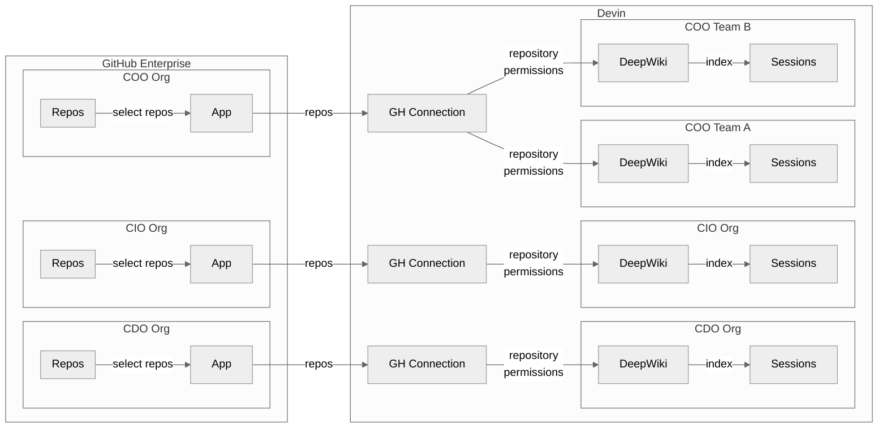

# Devin Enterprise RBAC at Scale

Python scripts for managing repository permissions and user provisioning in Devin Enterprise using the **v3 API**.

## Overview

This repo demonstrates how to set up Role-Based Access Control (RBAC) at scale for Devin Enterprise, including:
- **JIT (Just-In-Time) User Provisioning** via IDP group mapping
- **Automated organization creation** via API
- **Repository permission management** per sub-organization


```mermaid
---
config:
  theme: neutral
---
flowchart LR
 subgraph SubOrg1["CDO Org"]
        DW1["DeepWiki"]
        S1["Sessions"]
  end
 subgraph SubOrg2["CIO Org"]
        DW2["DeepWiki"]
        S2["Sessions"]
  end
 subgraph SubOrg3A["COO Team A"]
        DW3A["DeepWiki"]
        S3A["Sessions"]
  end
 subgraph SubOrg3B["COO Team B"]
        DW3B["DeepWiki"]
        S3B["Sessions"]
  end
 subgraph MainOrg["Devin"]
    direction TB
        SubOrg1
        SubOrg2
        SubOrg3A
        SubOrg3B
        GH1["GH Connection"]
        GH2["GH Connection"]
        GH3["GH Connection"]
  end
 subgraph Repos1["Repos"]
  end
 subgraph SubOrgA["CDO Org"]
        App1["App"]
        Repos1
  end
 subgraph Repos2["Repos"]
  end
 subgraph SubOrgB["CIO Org"]
        App2["App"]
        Repos2
  end
 subgraph Repos3["Repos"]
  end
 subgraph SubOrgC["COO Org"]
        App3["App"]
        Repos3
  end
 subgraph CloudOrg["GitHub Enterprise"]
    direction TB
        SubOrgA
        SubOrgB
        SubOrgC
  end
    App1 -- repos --> GH1
    App2 -- repos --> GH2
    App3 -- repos --> GH3
    GH1 -- repository 
  permissions --> DW1
    GH2 -- repository
  permissions --> DW2
    GH3 -- repository
  permissions --> DW3A
    GH3 -- repository
  permissions --> DW3B
    DW1 -- index --> S1
    DW2 -- index --> S2
    DW3A -- index --> S3A
    DW3B -- index --> S3B
    Repos1 -- select repos --> App1
    Repos2 -- select repos --> App2
    Repos3 -- select repos --> App3
```

## JIT Provisioning Workflow

Devin supports **JIT (Just-In-Time) Provisioning** with group-matching. When a user signs in via SSO, they are automatically matched to the correct sub-organization based on their IDP group membership.

### Setup Flow

1. **Create Organizations via API** - Use the service account to create sub-organizations
2. **Map IDP Groups to Organizations** - Assign IDP groups to orgs with appropriate roles
3. **JIT Provisioning Activates** - Users automatically get access when they sign in
4. **Onboard Repositories** - Grant repo permissions to each organization

### Step 1: Create Organizations

Use `create_organization.py` to create sub-organizations for each team or group that needs isolated access.

### Step 2: Map IDP Groups to Organizations

Use `assign_idp_group.py` to map your SSO/IDP groups to Devin organizations. Run `list_roles.py` first to see available role IDs.

### Step 3: JIT Provisioning (Automatic)

Once IDP groups are mapped, users automatically get access to their assigned organizations when they sign in via SSO. No additional action required.

### Step 4: Onboard Repositories

#### 4a. Set up GitHub Connections (Manual)

Each [GitHub organization](https://docs.github.com/en/enterprise-cloud@latest/admin/managing-accounts-and-repositories/managing-organizations-in-your-enterprise/adding-organizations-to-your-enterprise#creating-a-new-organization) needs to be manually added as a [connection in Devin](https://docs.devin.ai/integrations/gh#setting-up-the-integration):

1. Go to **app.devin.ai > Enterprise Settings > Integrations > Connected Accounts > GitHub**
2. Add each GitHub organization as a separate connection
3. When creating the connection, choose to:
   - Make all repositories in the organization available to Devin, OR
   - Select specific repositories only

**Note**: The Devin integration appears as a [GitHub App](https://docs.github.com/en/enterprise-cloud@latest/apps/github-marketplace/github-marketplace-overview/about-github-marketplace-for-apps#apps). Only GitHub Enterprise account administrators or org admins typically have the permissions required to modify GitHub App installations and update Devin's repository access.

#### 4b. Grant Repository Permissions (Automated)

Use `set_repo_permissions.py` to grant repository access to specific Devin organizations. Run `list_connections.py` first to get connection IDs.

#### 4c. Index Repositories (Automated)

Use `index_repositories.py` to index repositories and make them available as [Deep Wikis](https://docs.devin.ai/work-with-devin/deepwiki) for use in Devin sessions.

#### 4d. Set Up Machine Snapshots (Optional)

For repositories with specific build tools, dependencies, and environment configurations, you can set up machine snapshots through the Devin UI. Configure through **Settings > Devin's Workspace** in the Devin app. See the [Repo Setup Guide](https://docs.devin.ai/onboard-devin/repo-setup) for details.

## Getting Started

### Prerequisites

- Python 3.8+
- A Devin Enterprise **Service User** API key (prefix: `cog_`)

### Setup

1. Install dependencies:
   ```bash
   pip install -r requirements.txt
   ```

2. Set your Service User API key in `.env`:
   ```
   DEVIN_SERVICE_ACCOUNT_API_KEY=cog_your_service_user_key_here
   ```

> **Note:** The v3 API requires a Service User credential (prefix: `cog_`), not a regular API key (prefix: `apk_`). Create a Service User in **Enterprise Settings > Service Users**.

## Scripts

### Organization & User Management

| Script | Description |
|--------|-------------|
| `list_organizations.py` | List all sub-organizations in your enterprise |
| `create_organization.py` | Create a new sub-organization |
| `list_roles.py` | List available roles (for IDP group assignment) |
| `list_idp_groups.py` | List IDP groups and their org/role mappings |
| `assign_idp_group.py` | Assign an IDP group to an org (enables JIT provisioning) |

### Repository Permissions

| Script | Description |
|--------|-------------|
| `list_connections.py` | List all Git connections (enterprise-level) |
| `list_permissions.py` | List repo permissions for an organization |
| `set_repo_permissions.py` | Grant repository access to an organization |
| `index_repositories.py` | Index repos to make them available in sessions |

## Workflow

### 1. List Your Organizations
```bash
python list_organizations.py
```
Find the organization ID you want to manage.

### 2. List IDP Group Mappings (Optional)
```bash
python list_idp_groups.py
```
View which IDP groups are mapped to which organizations with what roles.

### 3. List Git Connections
```bash
python list_connections.py
```
Get the connection ID for the GitHub organization containing your repository.

### 4. List Existing Permissions (Optional)
```bash
python list_permissions.py
```
View current repository permissions for an organization.

### 5. Grant Repository Permissions
```bash
python set_repo_permissions.py
```
Add permissions for a specific repository to your Devin organization.

### 6. Index the Repository
```bash
python index_repositories.py
```
Index the repository to make it available for use in Devin sessions.

## Script Details

### `list_organizations.py`
- Lists all Devin sub-organizations in your enterprise
- Shows organization names and IDs
- **Endpoint:** `GET /v3beta1/enterprise/organizations`

### `create_organization.py`
- Creates a new sub-organization
- Configure: `ORG_NAME`, optional ACU limits
- **Endpoint:** `POST /v3beta1/enterprise/organizations`

### `list_roles.py`
- Lists available roles for assignment
- Built-in roles: `org_member`, `org_admin`, `org_deepwiki`, `account_admin`, `account_member`
- Custom roles have UUID format: `role-xxxxxxxxxxxxxxxxxxxxxxxxxxxxxxxx`
- **Endpoint:** `GET /v3beta1/enterprise/roles`

### `list_idp_groups.py`
- Lists IDP groups configured in your enterprise
- Shows role assignments (enterprise and org-level)
- **Endpoint:** `GET /v3beta1/enterprise/members/idp-groups`

### `assign_idp_group.py`
- Assigns an IDP group to an organization with a role
- Enables JIT provisioning for users in that SSO group
- Configure: `ORG_ID`, `IDP_GROUP_NAME`, `ROLE_ID`
- **Endpoint:** `POST /v3beta1/enterprise/organizations/{org_id}/members/idp-groups/{idp_group_name}`

### `list_connections.py`
- Lists Git connections at the enterprise level (not org-scoped)
- Shows connection IDs, names, provider types, and hosts
- **Endpoint:** `GET /v3beta1/enterprise/git-providers/connections`

### `list_permissions.py`
- Lists repository permissions for a specific organization
- Configure: `ORG_ID`
- **Endpoint:** `GET /v3beta1/enterprise/organizations/{org_id}/git-providers/permissions`

### `set_repo_permissions.py`
- Grants repository access to a Devin organization
- Configure:
  - `ORG_ID` - Target organization
  - `CONNECTION_ID` - Git connection ID
  - `REPOSITORY_PATH` - Repository path (format: "owner/repo")
- **Endpoint:** `POST /v3beta1/enterprise/organizations/{org_id}/git-providers/permissions`

### `index_repositories.py`
- Indexes repositories to make them available in Devin sessions
- Configure:
  - `ORG_ID` - Target organization
  - `REPOSITORIES` - List of repositories to index (format: "owner/repo")
- **Endpoint:** `POST /beta/v2/enterprise/repositories/bulk-index`

## Example

After setting up a GitHub connection for `mycompany` organization in Devin:

1. **Find your Devin organization ID:**
   ```bash
   python list_organizations.py
   # Output: org-406782bf7ec34819b0c3bd0ba67a5c84 (my-team)
   ```

2. **Check IDP group mappings:**
   ```bash
   python list_idp_groups.py
   # Shows which SSO groups map to which orgs
   ```

3. **Find the GitHub connection ID:**
   ```bash
   python list_connections.py  
   # Output: git-connection-54e8883977654c76ae4fc1746cb68fd6 (mycompany)
   ```

4. **Grant access to a repository:**
   ```bash
   # Edit set_repo_permissions.py:
   # ORG_ID = "org-406782bf7ec34819b0c3bd0ba67a5c84"
   # CONNECTION_ID = "git-connection-54e8883977654c76ae4fc1746cb68fd6"
   # REPOSITORY_PATH = "mycompany/backend-api"
   python set_repo_permissions.py
   # ✓ Success!
   ```

5. **Index the repository:**
   ```bash
   # Edit index_repositories.py:
   # ORG_ID = "org-406782bf7ec34819b0c3bd0ba67a5c84"
   # REPOSITORIES = ["mycompany/backend-api"]
   python index_repositories.py
   # ✓ Indexing started.
   ```

## API Documentation

- [v3 API Overview](https://docs.devin.ai/api-reference/v3/overview)
- [List Organizations](https://docs.devin.ai/api-reference/v3/organizations/organizations)
- [Create Organization](https://docs.devin.ai/api-reference/v3/organizations/post-organizations)
- [List IDP Groups](https://docs.devin.ai/api-reference/v3/idp-groups/members-idp-groups)
- [Assign IDP Group to Org](https://docs.devin.ai/api-reference/v3/idp-groups/post-organizations-members-idp-groups)
- [List Git Connections](https://docs.devin.ai/api-reference/v3/git-connections/git-providers-connections) 
- [List Git Permissions](https://docs.devin.ai/api-reference/v3/git-permissions/organizations-git-providers-permissions)
- [Add Git Permissions](https://docs.devin.ai/api-reference/v3/git-permissions/post-organizations-git-providers-permissions)
