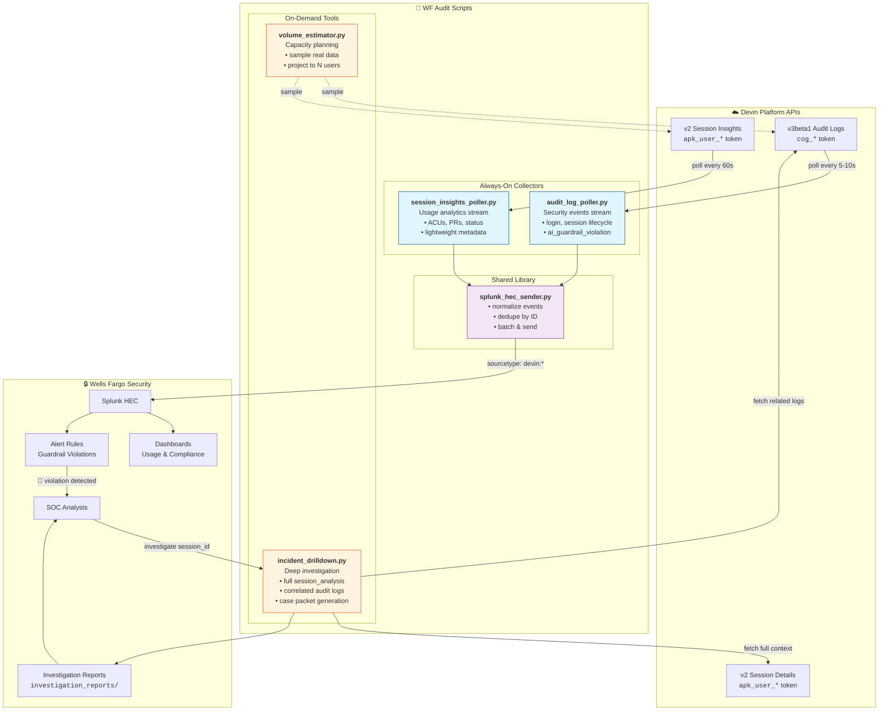

# Devin Audit & Session Scripts - Architecture

## Overview Diagram



## Data Flow Summary

### 1️⃣ Always-On: Security Event Stream
```
Devin Audit API ──► audit_log_poller.py ──► splunk_hec_sender.py ──► Splunk
     │                     │
     │              Filters for:
     │              • ai_guardrail_violation (CRITICAL)
     │              • login
     │              • create/terminate/sleep_session
     │
     └── Poll every 5-10 seconds, cursor-based pagination
```

### 2️⃣ Always-On: Usage Analytics Stream (Optional)
```
Devin Sessions API ──► session_insights_poller.py ──► splunk_hec_sender.py ──► Splunk
     │                         │
     │                  Captures:
     │                  • session_id, status
     │                  • acus_consumed
     │                  • pull_requests (count/state)
     │                  • tags, timestamps
     │
     └── Poll every 60 seconds, skip/limit pagination
         Does NOT include full session_analysis (too large)
```

### 3️⃣ On-Demand: Incident Investigation
```
SOC Alert ──► incident_drilldown.py ──┬──► Devin Session Details API
   │                │                 │         (full session_analysis)
   │                │                 │
   │                │                 └──► Devin Audit Logs API
   │                │                          (correlated by session_id)
   │                │
   │                └──► investigation_reports/inv-{session_id}-{ts}.json
   │                              │
   └──────────────────────────────┘
```

### 4️⃣ Capacity Planning
```
volume_estimator.py ──┬──► Sample audit logs (N hours)
                      │
                      └──► Sample session insights (N hours)
                                │
                                └──► Project to M users
                                        │
                                        └──► GB/day, GB/month estimates
```

## Script Responsibilities

| Script | Runs | Auth | What it Does | Splunk Sourcetype |
|--------|------|------|--------------|-------------------|
| `audit_log_poller.py` | Continuous | `cog_*` | Poll security events | `devin:audit_log` |
| `session_insights_poller.py` | Continuous | `apk_user_*` | Poll usage metadata | `devin:session` |
| `incident_drilldown.py` | On-demand | Both | Deep investigation | N/A (file output) |
| `volume_estimator.py` | One-time | Both | Estimate Splunk volume | N/A (console) |
| `splunk_hec_sender.py` | Library | Splunk token | Normalize & send events | — |

## State Files

| File | Created By | Purpose |
|------|------------|---------|
| `audit_poller_state.json` | audit_log_poller.py | Tracks `last_time_after` watermark, seen IDs |
| `session_poller_state.json` | session_insights_poller.py | Tracks `last_updated_after`, seen sessions |
| `investigation_reports/*.json` | incident_drilldown.py | Complete investigation packets |

## Two-Tier Strategy Explained

```
┌─────────────────────────────────────────────────────────────────────┐
│                        ALWAYS INGEST (Tier 1)                       │
│                                                                     │
│  Low volume, high signal:                                           │
│  • Audit events: login, session lifecycle, guardrail violations     │
│  • Session metadata: IDs, status, ACUs, PR counts                   │
│                                                                     │
│  Storage: ~1-10 MB/day typical                                      │
└─────────────────────────────────────────────────────────────────────┘
                                │
                                │ Alert triggers investigation
                                ▼
┌─────────────────────────────────────────────────────────────────────┐
│                      ON-DEMAND ONLY (Tier 2)                        │
│                                                                     │
│  High volume, pulled when needed:                                   │
│  • Full session_analysis (timeline, issues, action_items)           │
│  • Complete initial_user_message (prompts can be large)             │
│  • Correlated audit log slice for investigation window              │
│                                                                     │
│  Storage: Only what's investigated, saved to investigation_reports/ │
└─────────────────────────────────────────────────────────────────────┘
```

## Why This Design?

1. **Proxy bypass**: Devin doesn't route through WF proxy → need API-based logging
2. **Cost control**: Full session data is large; only pull when needed
3. **SOC workflow**: Continuous alerting + on-demand investigation matches existing patterns
4. **Separation of duties**: Scripts collect, Splunk detects, SOC investigates
