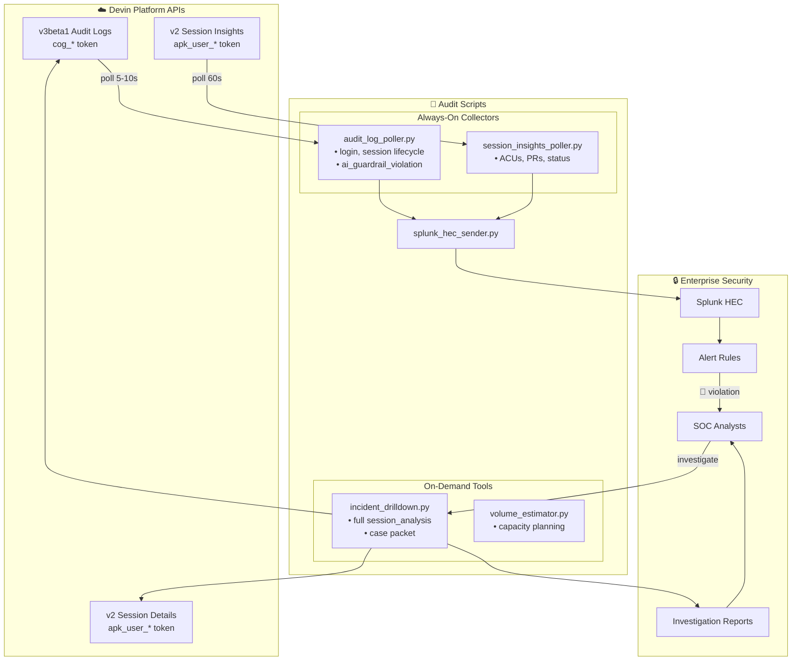

# Devin Audit & Session Log Collection Scripts

Reference implementations for collecting Devin audit logs and session data for SIEM integration.

## Why These Scripts Exist

Devin does not sit behind the enterprise proxy, so traditional network-level logging is not available. These scripts provide the **compensating control**: they pull authoritative audit, session, and usage data directly from Devin and deliver it to your SIEM (e.g., Splunk).

## Scripts Overview

| Script | Purpose | API | Auth Token |
|--------|---------|-----|------------|
| `audit_log_poller.py` | Continuous polling of security events | v3beta1 | `cog_*` (Service User) |
| `session_insights_poller.py` | Session lifecycle & usage tracking | v2 | `apk_user_*` (Enterprise Admin) |
| `incident_drilldown.py` | On-demand deep investigation | v2 + v3 | Both |
| `volume_estimator.py` | Estimate Splunk storage needs | v2 + v3 | Both |
| `splunk_hec_sender.py` | Shared mock Splunk HEC sender | N/A | Splunk HEC token |

## Quick Start

```bash
# 1. Ensure you're in the project root with .env configured
cd /path/to/devin-repo-rbac-at-scale

# 2. Activate virtual environment
source .venv/bin/activate

# 3. Install dependencies (if not already)
uv pip install requests python-dotenv

# 4. Run a single poll cycle (dry run - no actual Splunk send)
python audit_log_api/audit_log_poller.py --once

# 5. Run session insights poller
python audit_log_api/session_insights_poller.py --once

# 6. Estimate volume for 100 users based on 24h sample
python audit_log_api/volume_estimator.py --hours 24 --users 100

# 7. Investigate a specific session
python audit_log_api/incident_drilldown.py --session <session_id> --save
```

## Environment Variables

Required in `.env`:

```bash
# v3 API (audit logs, org management)
DEVIN_SERVICE_ACCOUNT_API_KEY=cog_your_service_user_key

# v2 API (session details, insights)
DEVIN_ADMIN_USER_API_KEY=apk_user_your_enterprise_admin_key

# Splunk HEC (optional - scripts mock by default)
SPLUNK_HEC_URL=https://splunk.example.com:8088/services/collector/event
SPLUNK_HEC_TOKEN=your-hec-token
SPLUNK_INDEX=devin_logs
```

## Architecture: Two-Tier Logging Strategy



### Always-On (Low Volume, High Signal)
- **Audit Log Poller**: Captures `login`, `create_session`, `terminate_session`, `sleep_session`, `ai_guardrail_violation`
- **Session Insights Poller**: Captures session metadata, ACU usage, PR activity

### On-Demand (Full Context When Needed)
- **Incident Drilldown**: Pull complete session details only during investigations

This approach minimizes Splunk storage while maintaining full investigative capability.

## API Reference

### v3beta1 Audit Logs
- **Endpoint**: `GET /v3beta1/enterprise/audit-logs`
- **Auth**: Service User credential (`cog_*`)
- **Docs**: https://docs.devin.ai/api-reference/v3/audit-logs/enterprise-audit-logs

Key parameters:
- `time_after`, `time_before`: Unix timestamps (UTC, range ≤ 100 days)
- `action`: Filter by action type
- `first`: Page size (max 200)
- `after`: Cursor for pagination

### v2 Session Insights
- **Endpoint**: `GET /v2/enterprise/sessions/insights`
- **Auth**: Personal API Key for Enterprise Admin (`apk_user_*`)
- **Docs**: https://docs.devin.ai/api-reference/v2/sessions/list-enterprise-sessions-insights

Key parameters:
- `updated_date_from`, `updated_date_to`: ISO datetime filters
- `skip`, `limit`: Pagination (limit max 200)

## Recommended Audit Log Actions

### Security-Critical (Always Ingest)
| Action | Description |
|--------|-------------|
| `ai_guardrail_violation` | DLP-style policy trigger |
| `login` | User authentication |
| `create_session` | Session started |
| `terminate_session` | Session ended |
| `sleep_session` | Session paused |

### Governance/Compliance (Optional)
| Action | Description |
|--------|-------------|
| `create_github_integration` | GitHub connected |
| `delete_github_integration` | GitHub disconnected |
| `mcp_server_install` | MCP server installed |
| `create_role` / `delete_role` | RBAC changes |
| `assign_roles` | Permission changes |

See full list in API docs.

## Splunk Integration

### Event Schema

**Audit Log Events** (`sourcetype: devin:audit_log`):
```json
{
  "event_type": "devin_audit_log",
  "audit_log_id": "unique-id",
  "action": "login",
  "created_at": 1703001234,
  "org_id": "org-123",
  "user_id": "user-456",
  "user_email": "user@example.com",
  "data": {}
}
```

**Session Events** (`sourcetype: devin:session`):
```json
{
  "event_type": "devin_session",
  "session_id": "sess-789",
  "status": "running",
  "acus_consumed": 5,
  "pull_requests": [{"url": "...", "state": "open"}],
  "created_at": "2024-01-15T10:30:00Z",
  "updated_at": "2024-01-15T11:00:00Z"
}
```

### Production Deployment

To enable real Splunk ingestion:
1. Configure `SPLUNK_HEC_*` environment variables
2. Uncomment the HTTP POST code in `splunk_hec_sender.py`
3. Run pollers with `--live` flag

## Customization Notes

These scripts are **reference implementations**. For production:
- Add proper error handling and alerting
- Use a persistent state store (Redis, database) instead of JSON files
- Implement retry logic with exponential backoff
- Consider running as systemd services or Kubernetes deployments
- Add metrics/observability for the pollers themselves
